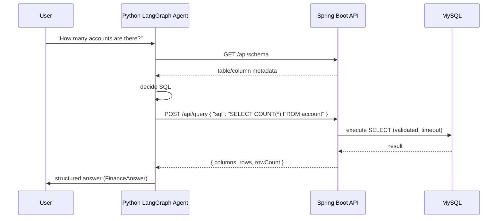

# Project 1: Finance NL Query (Spring Boot + LangGraph)

A **dual-stack** setup: a **Spring Boot 3.4** service that owns MySQL finance tables and a **Python LangGraph** agent that answers natural language questions about that data by calling the backend’s schema and query APIs.

## Why this matters for business (ROI)

- **Self-serve analytics**: Business users ask questions in plain English instead of writing SQL.
- **Controlled data access**: All queries go through one backend (read-only, timeout, audit).
- **BFSI-ready**: Single place to enforce PII masking and security before any data reaches the LLM.

## Architecture



## Tech stack

| Layer | Stack |
|-------|--------|
| Backend | Java 21, Spring Boot 3.4, JPA/Hibernate, MySQL, Micrometer/Prometheus |
| Agent | Python 3.12+, LangGraph, LangChain OpenAI, Pydantic |

## Quick start

### 1. MySQL and schema

Create the database (Flyway will create tables and seed data on first run):

```bash
mysql -u root -p -e "CREATE DATABASE IF NOT EXISTS finance_db;"
```

Configure connection via env (no secrets in repo), or use the **local** profile with `application-local.yml` (gitignored):

```bash
# Option A: env vars
export SPRING_DATASOURCE_URL="jdbc:mysql://localhost:3306/finance_db"
export SPRING_DATASOURCE_USERNAME=finance_user
export SPRING_DATASOURCE_PASSWORD=your_password

# Option B: local profile (copy application-local.example.yml to application-local.yml and set credentials, then:)
./mvnw spring-boot:run -Dspring-boot.run.profiles=local
```

### 2. Run the backend

```bash
cd backend
./mvnw spring-boot:run
```

- Schema: `GET http://localhost:8080/api/schema`
- Query: `POST http://localhost:8080/api/query` with `{"sql": "SELECT COUNT(*) FROM account"}`

The backend uses **Flyway** migrations: `V1__retail_banking_schema.sql` defines the full schema (branch, customer, account, transaction, loan); `V2__seed_100_rows.sql` inserts 100 rows of dummy retail banking data (5 branches, 20 customers, 25 accounts, 35 transactions, 15 loans).

### 3. Run the Python agent

```bash
cd python_agent
python -m venv .venv
source .venv/bin/activate   # or .venv\Scripts\activate on Windows
pip install -r requirements.txt
cp .env.example .env
# Set OPENAI_API_KEY and optionally FINANCE_API_BASE_URL in .env
python -m agent "How many accounts are there?"
```

Output is a **structured** `FinanceAnswer` (JSON): `answer`, `sql_used`, `summary`.

## Project layout

```
backend/                    # Spring Boot
  src/main/java/.../        # entities (Branch, Customer, Account, Transaction, Loan), DTOs, services, controller
  src/main/resources/db/
    migration/              # Flyway: V1__retail_banking_schema.sql, V2__seed_100_rows.sql
python_agent/               # LangGraph
  agent.py                  # ReAct agent, FinanceAnswer
  tools.py                  # get_finance_schema, run_finance_query
  schemas.py                # Pydantic FinanceAnswer
  config.py                 # env-based config
  tests/                    # pytest (evaluation)
```

## Technical challenges overcome

- **Read-only and safety**: Backend only allows `SELECT`, validates SQL, and applies a query timeout so the agent cannot mutate data or run long jobs.
- **Structured outputs**: The agent returns a Pydantic `FinanceAnswer`; no ad-hoc string parsing.
- **Observability**: Micrometer timers for schema fetch and query execution; failure counter for agent query errors.

## Tests

- **Backend**: `cd backend && ./mvnw test` (JUnit 5, H2 for query service tests).
- **Agent**: `cd python_agent && pytest tests/` (schema + structured output + mocked tool calls).

## Security note

Never commit API keys. Use `.env` (gitignored) and `SPRING_DATASOURCE_*` / `OPENAI_API_KEY` in env. For production, add auth (e.g. `AGENT_API_KEY`) on the backend and PII masking before sending any rows to the LLM.
